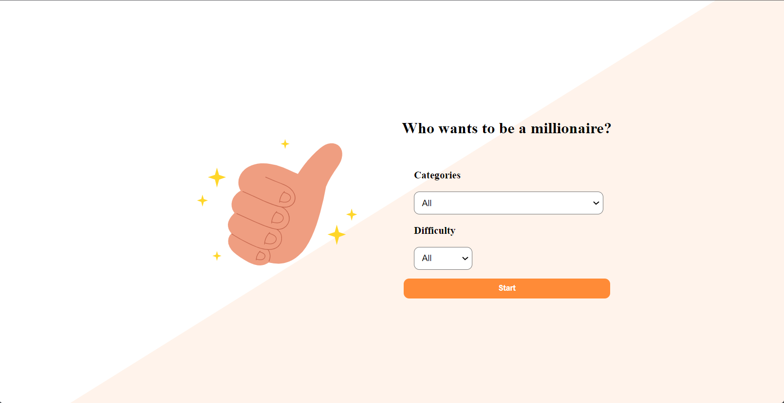
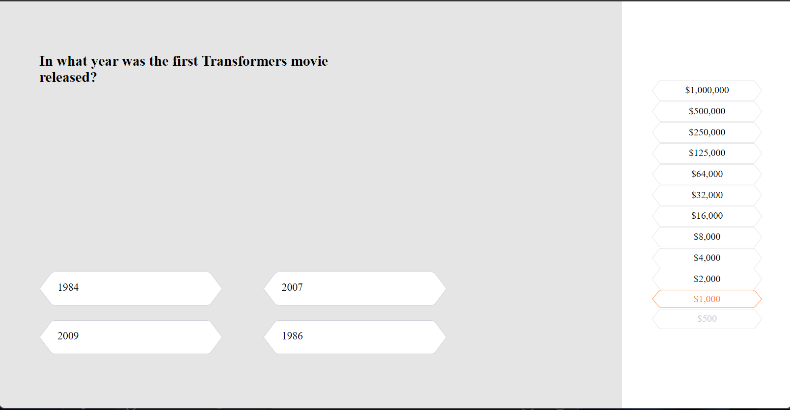
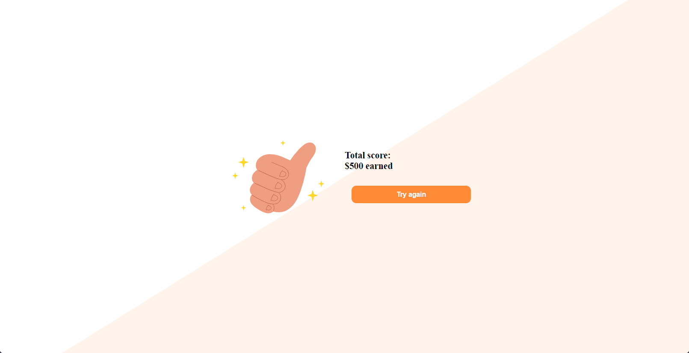
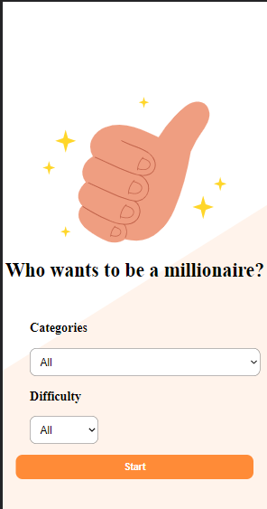
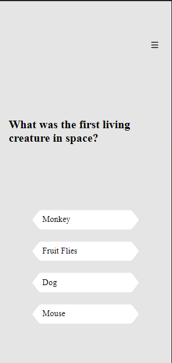
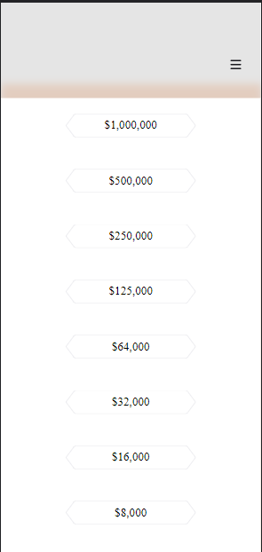
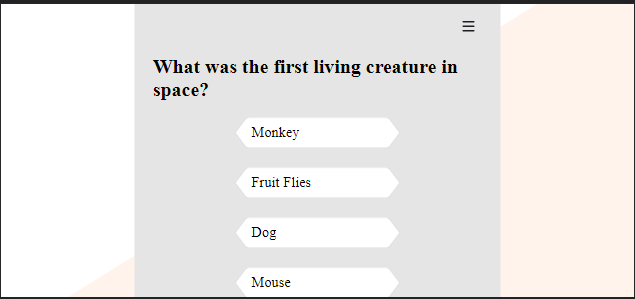
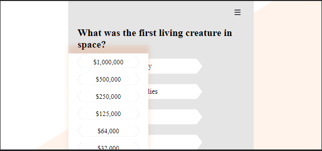
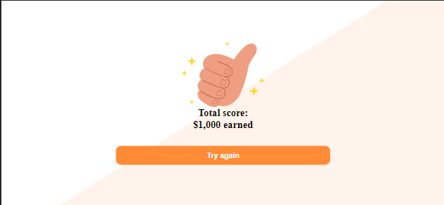
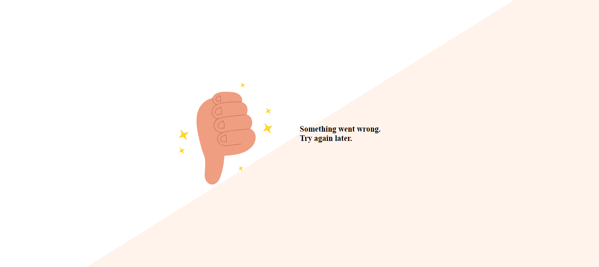

#About project 

This is a "Who want's to be a millionaire" quiz app.

Game process:
1. Player selects questions category and difficulty
2. The player takes turns answering one of the 12 questions. 
3. Each question has 4 possible answers and only one is correct. 
4. If the answer is correct, the player gets to the next question increasing the winnings. If the answer is incorrect, the player is taken to the final screen.
5. On the final screen user can move back to selecting options and restart

You can try yourself to get a highest score, it is real challenging.
There is an opportunity to choose one of the categories, and for those who consider themselves an encyclopedia, there is an opportunity to get a set of random questions from all categories and all difficulties.
If the questions are too difficult for you, or, on the contrary, too easy, then you can choose the level of difficulty of the questions.

The application will not only give you the opportunity to test yourself, but also to learn many different interesting facts.

# Technical part
##Technical stack
1. HTML/CSS
2. JS
3. React 
4. Redux 
5. Webpack
6. Prettier
  
The application is written in React, I used Redux to control the state, I think that this technology stack allowed me to build a good code structure that is easy to read and expand in the future.

##Api

For getting questions I used API **https://opentdb.com/api_config.php**

The API gives  the ability to access hundreds of different questions and get questions according to the user's choice.

##Project features
1. Architectural organization of the code. 
2. Correct processing of random situations.
3. Adaptive layout

##Screenshots

## Desktop
##Options

##Process

##Final screen

#Mobile portrait orientation
##Options

##Process

##Winnings

##Final screen

#Mobile landscape orientation
##Process

##Winnings

##Final screen

# Error screen (Internet disconnection, Problems with API response)

# Run app
In the project directory, you can run:

### `npm start`
Runs the app in the development mode.\
Open [http://localhost:3000](http://localhost:3000) to view it in your browser.

The page will reload when you make changes.\
You may also see any lint errors in the console.
